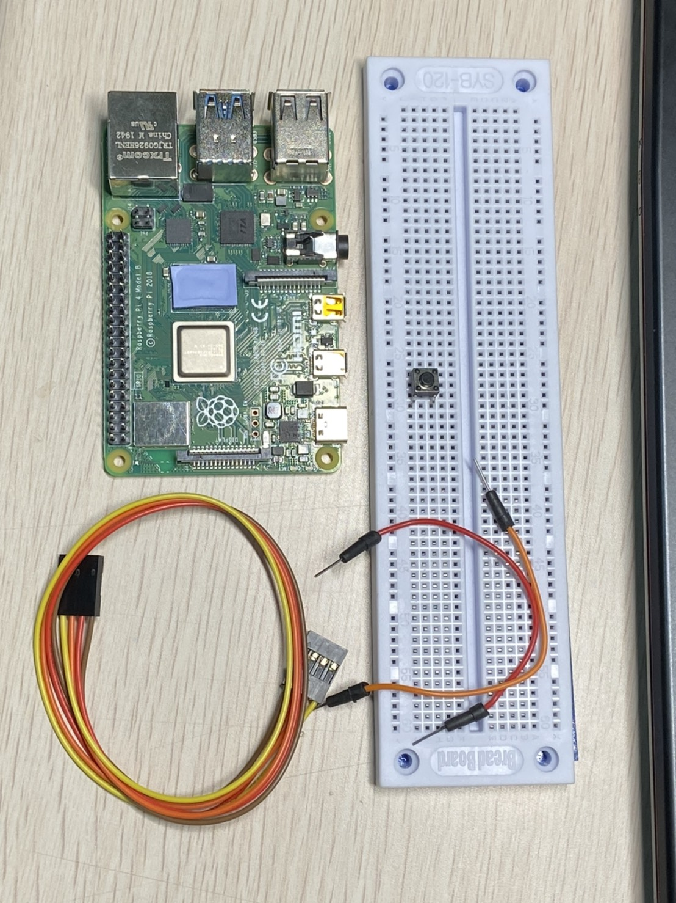
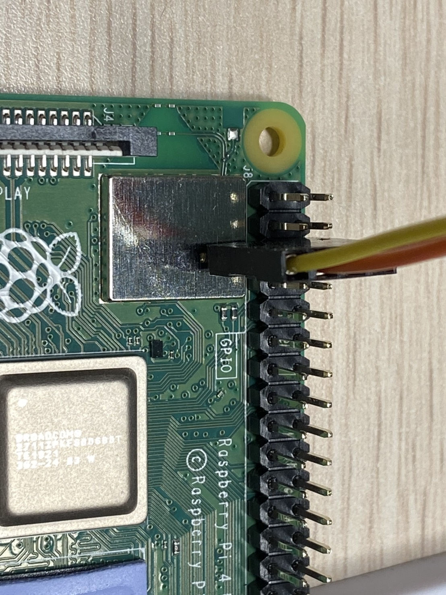
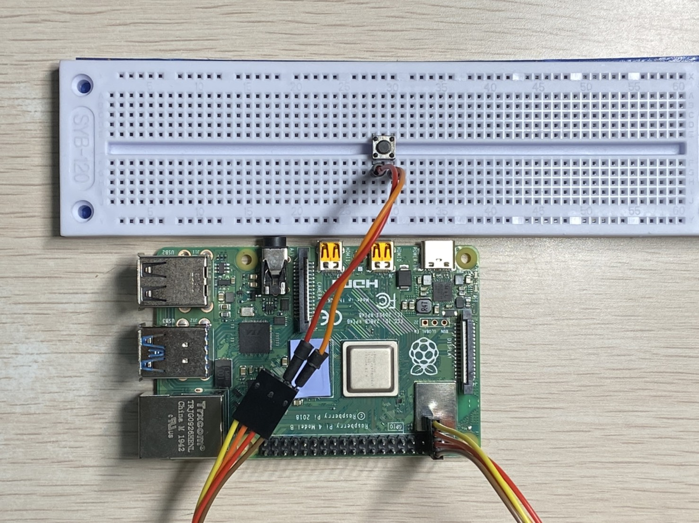

# RaspberryPi_PowerOffBotton

## 事前準備材料
* 麵包版*1
* 杜邦線(公對母)*2
* 按鈕*1
* RaspberryPi*1



## 創建專案
建立檔案
```
sudo nano python_program/BottonOFF.py
```
加入程式碼
```
#!/usr/bin/env python

# Import Libraries
import RPi.GPIO as GPIO
import subprocess

# Define GPIO Pin Number
gpioPin=3

# Define GPIO Function
GPIO.setmode(GPIO.BCM)
GPIO.setup(gpioPin, GPIO.IN)
GPIO.wait_for_edge(gpioPin, GPIO.FALLING)

# Command
subprocess.call(['shutdown', '-h', 'now'], shell=False)
```

## 實際圖
輸出腳位



成品



實際操作


<br>

> 參考資料: [Rapsberry Pi 的實作 - 製作一顆用來關機的電源按鈕](http://blog.itist.tw/2017/03/diy-power-and-reset-button-for-raspberry-pi.html)
